# **室内行人移动方位推算技术实验报告**

### **1. 小组成员信息**

| **成员姓名** | **成员邮箱**               | **成员分工**                                           |
| ------------ | -------------------------- | ------------------------------------------------------ |
| 史浩宇       | 201300052@smail.nju.edu.cn | 算法选择、姿态矫正、数据预处理、绘图、收集数据         |
| 史浩男       | 201300086@smail.nju.edu.cn | 算法选择、步幅预测、参数寻优、绘图、收集数据、数据共享 |
| 鲁权锋       | 201830168@smail.nju.edu.cn | 算法选择、步幅预测、收集数据、测试评估                 |

------

### **2. 数据收集**

为了便于后续更好地提高模型的泛化性能，充分训练我们的模型，我们收集了各种状态下、不同区域下的数据，尽可能保证了数据集的多样性。为了保证数据的真实、准确和有效，我们的每一份数据都是在户外独立收集，且时长均大于3分钟，频率设为50Hz。此外，考虑到压力传感器的数据仅用于计算高度，并且有些手机是无法收集压力传感器的，我们在数据收集时对压力传感器没有要求。

#### **2.1 数据量**

我们创建了一个Github仓库，发起了一个数据共享计划：[2022秋高级机器学习第一次作业 PDR-小组数据共享计划](https://github.com/fireball0213/Dataset-of-Pedestrian-Dead-Reckoning)
，现在已经有17名同学加入了我们发起的仓库。我们小组三人共收集了50条数据，此外我们与其他小组合作共收集了84条数据，所有数据均上传至github上共享。

​                 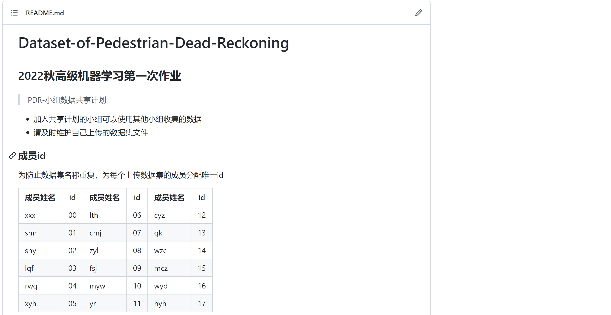

#### **2.2 数据状态及来源**

以上收集到的数据包括了如下9种状态的数据：

- 背包里-走路
- 背包里-骑车
- 手持-骑车
- 手持-走路
- 手持平稳-走路
- 手持摆臂-走路
- 口袋里-走走停停
- 口袋里-骑车
- 口袋里-走路

以上数据包含仙林和鼓楼两个区域，其中仙林54条，鼓楼30条。

​                 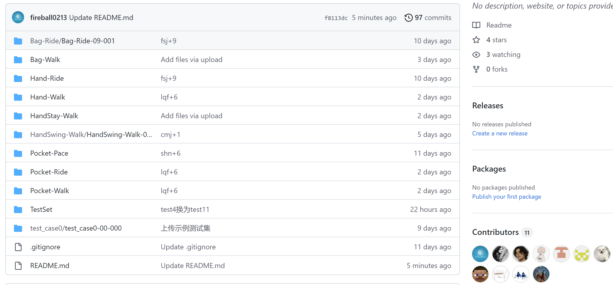

#### **2.3 数据集划分**

我们先按照我们实验的需求，抽取16条数据用于我们的消融实验。对于剩下的数据，我们对各种状态、不同区域、不同设备收集的数据按3:
1的比例分层随机抽样，其中75%的数据作为训练集，另外25%作为测试集。此外，我们还将助教提供的test_case0加入我们的测试集当中，因此最后我们共有52条数据作为训练集，17条数据作为总体测试集，16条数据作为消融实验的测试集。

------

### **3. 尝试方法与具体实现**

#### **3.1 算法分析与选择**

我们在分析数据集后发现，手机IMU传感器具有两个主要的缺点：噪声较大、会产生漂移问题；手机传感器的精度并不高；数据之间有较为明确的关系：例如，对于方位角我们可以通过磁场和角速度来计算得到，对于经纬度我们也可以通过物理公式计算求解。考虑到数据集的数量（大约80条）以及数据的特性，我们选择使用物理建模的方式，难点和重点在于物理公式的推演，数据的去噪和平滑以及误差的矫正方面。

#### **3.2 数据预处理**

##### **3.2.1 数据集类使用方法**

我们将所有的步行数据按照二级结构存储，第一级用于存储他所属的类型（例如：背包里-骑车），第二级用于存储某一条路径记录，二级文件夹下就是各种传感器的数据了：

​                 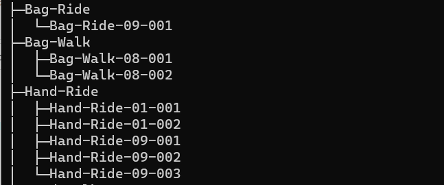

当代码编写者需要调用数据集中的数据时，只需要在config.json中配置好数据集文件的路径，就可以按照如下示例进行调用：

​                 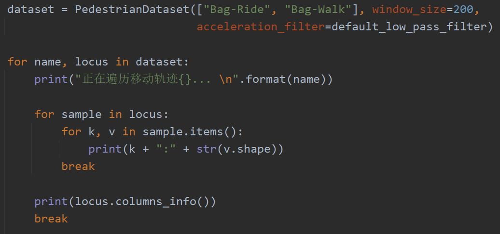

##### **3.2.2 数据集类内部具体处理方式**

在开始处理数据时，我们就发现了数据的时间对齐其实是存在问题的，每一个处理器都是按照自己的周期来进行采样，因此每个处理器csv文件的记录对应的时间戳是无法严格对齐的。但是，在对数据的性质进行了仔细地分析以后，我们认为数据其实是符合L-Lipschitz条件的。因此，某一数据点与它相距不到0.01s的状态应该是十分相近的，我们直接按照最近对齐的方式将所有传感器数据按照加速计的时间进行了合并对齐。其中比较特殊的是Location对应的GPS数据，它并没有直接和传感器数据进行对齐，而是进行了一些特殊的处理。

对于Location数据，其中的位置数据是以经纬度的形式进行存储的，但是，我们的预测系统最好是在以m为单位的笛卡尔坐标系上运行，毕竟，这样许多公式才有具体物理含义。我们利用地理支持库计算出了两点之间的距离与方位角，分别用 
与来进行表示，用O表示原点：

​                 

​                 

当最后程序要输出到Location_output.csv时，再通过逆变换将笛卡尔坐标系转换回经纬度表示的坐标体系。

#### **3.3 方位角预测**

##### **3.3.1 初步尝试：直接使地磁与重力加速度**

最开始，我们希望在每一时刻，直接利用地磁场数据（磁力计直接得到）与重力加速度数据（加速计与先加速计相减得到）来确定人和手机移动的方向角。不过，在尝试的过程中，我们发现磁力计的数据变化不是非常稳定，而测力计的数据噪声也很高。此外，经过研究也发现，由于手机的姿态有着3个自由度（绕xzy轴旋转），而之前提到的“地磁场数据”与“重力加速度数据”仅仅能帮助我们确定两个方向的信息，按照我们有限的了解，根据这两个数据是不太能完全矫正手机的姿态的。因此，我们决定更改思路，通过追踪陀螺仪的数据，来确定手机的姿态。

* 对比磁力计与陀螺仪效果
* 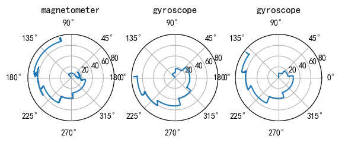

我们可以发现，左侧的磁力计效果是十分不稳定的，尤其是当运动速度变快的情况下。而即使是我们将手机放在电脑椅上高速旋转，陀螺仪仍可以精确捕捉旋转轨迹。

* 手机在电脑椅上旋转
* 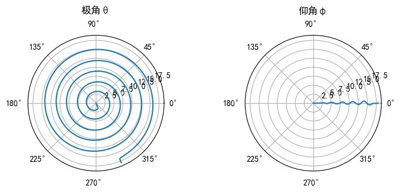

##### **3.3.2 最终方案：使用陀螺仪追踪手机姿态变化**

这是一个典型的牛顿力学问题，如果我们能够确定确定手机的初始姿态，再追踪确定手机在每一个轴上的旋转量，我们就可以获得手机在每一个时刻的姿态，进而通过计算，获得人移动的方向角。为统一讨论的方便，我们将z轴上的旋转角记为$\alpha$，将y轴上的旋转角记为 $\beta$，将x轴上的旋转角记为 $\gamma$。

* 手机IMU坐标系
* 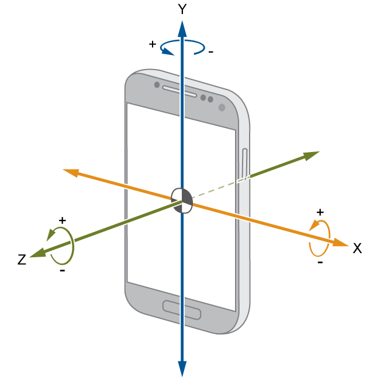

首先我们介绍一下，我们是如何测量初始姿态的。为了解决前文提出的困难，并使问题变得可处理，我们对手机的初始状态做出了一个假设：数据手机开始的时候，手机保持着被手持的姿势，也即，手机在IMU坐标系的y轴上旋转角为0。

* 我们所假设的手持手机姿态
* 

我们记重力加速度数据为g，记地磁场数据为B，其中 ：

​                 

因此，我们可以得到：

​                 

​                 

这样，我们就得到了手机的初始姿态信息。之后我们使用旋转矩阵对姿态旋转进行建模，这里的建模使用的是ZYX内旋方式：

​                 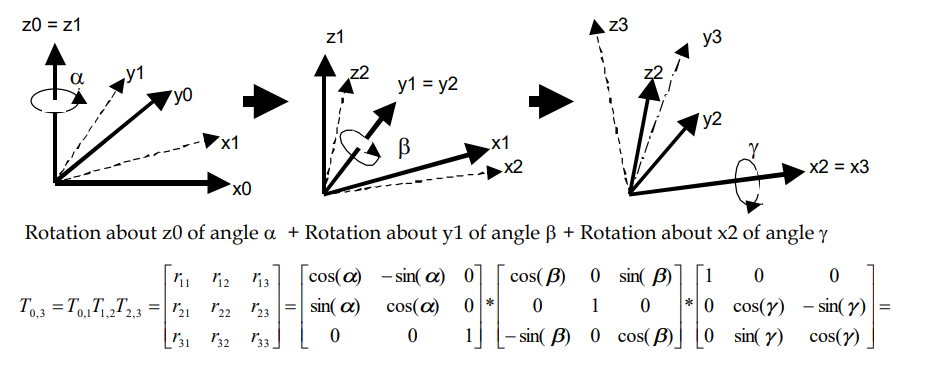

ZYX的内旋矩阵构建

之后，我们通过持续追踪陀螺仪在各个轴上的旋转量，经由中矩形积分，可以得到 $$\Delta\theta_i=\frac{d\theta}{dt}_i\times(t_{i+1}-t_{i-1})/2$$

之后，我们将之前得到的当恰尼姿态矩阵，按照xyz轴的旋转角外旋，可以得到新的姿态矩阵，我们将姿态矩阵记为：

​                 

那么，这个姿态矩阵如何使用呢？我们可以用它来做两件事情：

1. 我们可以通过姿态矩阵，将手机加速计测得的加速度从IMU坐标系直接转换到earth（世界）坐标系下，用于后续计算：

​                 

2. 我们可以通过姿态矩阵，计算得到从IMU坐标系绕z轴旋转多少度可以到达世界坐标系，用于后续测算行人的移动方向：
   * ZYX的内旋矩阵
   * 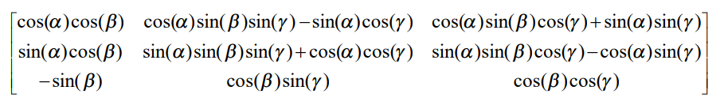

在通常情况下，我们只需要计算 就可以得到 $\alpha$对应的取值了，其中R对应为姿态矩阵。然而，在特殊情况下，例如仰角 ，这种计算方法将出现数值上的不稳定。为此我们对姿态矩阵的奇异情况进行了特殊的处理，通过更换为ZXY的内旋矩阵建模的方式，同样求得了航向角 $\alpha$ ，并规避了原本的仰角$\beta$为90°的情况。

#### **3.4 经纬度预测**

##### **3.4.1 初步尝试：直接卡尔曼滤波建模、牛顿运动力学直接计算轨迹**

1. 我们曾尝试直接使用卡尔曼滤波建模，通过前10%的方位信息去矫正观测值的误差，并且使用神经网络去学习偏差项。
   * 
   * 
   * 即为我们尝试学得的误差项

但是由于location.csv的数据测量的频率远低于加速度计等数据的测量频率，EKF会不断参与计算，在梯度回传的过程中很容易带来像RNN一样梯度消失或爆炸的问题，因此我们放弃使用神经网络。

2. 我们在做经纬度预测的时候，尝试过直接使用牛顿运动力学公式来计算移动的距离：

​                 

​                 

但是由于手机加速度计传感器有偏，且噪声干扰明显，最终位置的偏差较大。

* 我们直接使用运动公式的结果图示（预期图形为正方形）
* ​    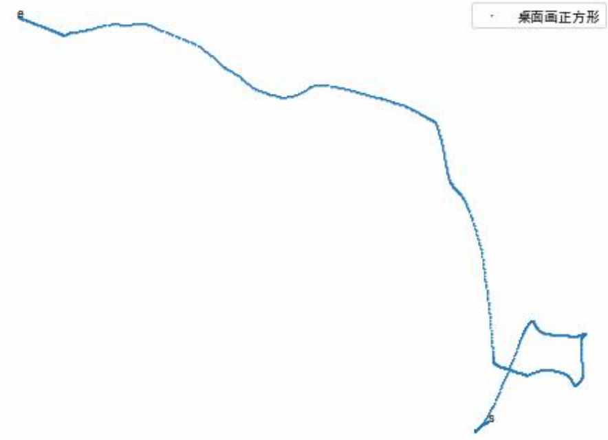

我们也曾尝试过使用卡尔曼滤波来矫正，但是仍然难以校准控制向量的误差，所以我们最后放弃这个思路。

##### **3.4.2 最终方案：使用步频+步幅预测轨迹**

1. 由于直接使用牛顿运动力学公式的偏差过大，我们后来选择使用步频+步幅的方式来预测运动的距离：  

对于步频，我们认为世界坐标系的z方向速度的变化和步频强相关。我们首先对线加速度计得到的的加速度做低通滤波，利用姿态矩阵将其变换到世界坐标系后，对时间积分，得到z方向的速度。然后根据z方向的速度的波形图来计算峰值的个数，得到步频。

在最开始，我们粗略假定步幅不变，设定步幅： ，发现得到了和预期结果接近的轨迹图，相比直接使用牛顿运动力学预测有极大的效果提升。

* 步频+步幅预测轨迹（预期图形为矩形，可以看到比直接使用运动公式的效果有了极大提升）
* 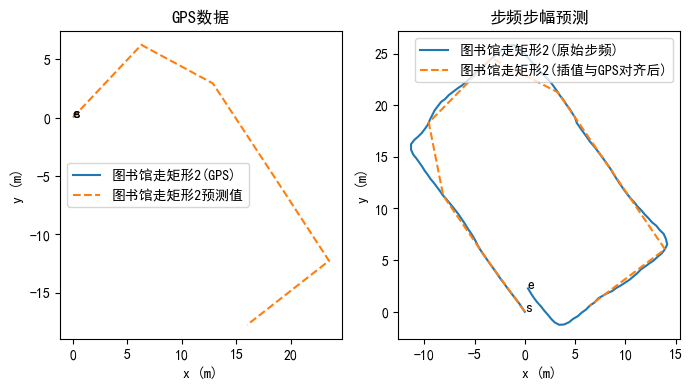
* 步频+步幅预测轨迹（左图为GPS定位图，右图为步频+步幅预测图）
* 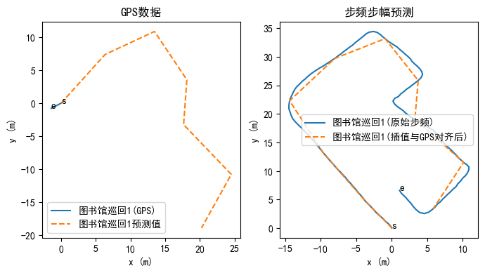
* 注：由于该仅用于测试效果的数据采样时位于室内，GPS数据有所残缺。

2. 接下来我们对步幅的估计进行改进。我们首先对加速度做8阶的低通滤波，然后我们尝试根据世界坐标系的加速度的波幅（下图中的H）和间距（下图中的W）来估计步幅。
   * 波幅（H）和间距（W）示意图
   * 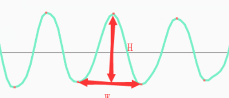

我们结合物理经验，利用如下公式来计算步幅：

* 
* 其中A、B、C为三个待学参数，W和H分别为波长和波幅

我们在训练集上对100%的数据，利用最小二乘法解出A、B、C三个参数的最优值：

​                 

​                 

​                 

由于步幅是使用相邻的两个波峰（波谷）来计算的，因此步幅预测个数会比步频数少一个。对于最后一次步幅，我们使用指数平滑方法估计：

​                 

我们在测试集上部分试验结果如下：

* 其中左图为GPS测量数据，右图为估计步幅预测数据
* 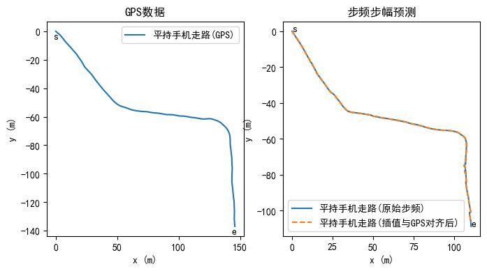
* 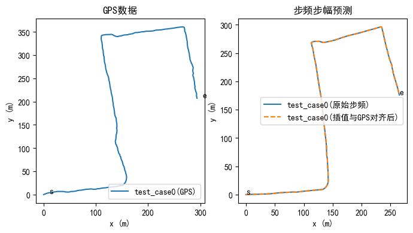              

可以看到，效果有了进一步的提升，但是仍然略有不准。我们猜测问题来源于每个人的走路姿态、手机传感器灵敏度都有不同，不能仅根据训练集来确定A、B、C三个参数。因此我们考虑针对每一条具体的测试数据，对A、B、C三个参数做进一步微调。

3. 们对步幅估计进一步改进。我们考虑利用每一条测试数据的前10%，使用最小二乘法对上述求出来的三个参数A、B、C做微调寻优，为了使得参数更好的学习，考虑到人每一步走路的变化趋势并不大，我们对稀疏的GPS做插值。针对前10%方位数据微调后的结果图如下，可以看到我们可以做到非常好的拟合结果。
   * 对前10%的方位数据参数寻优后的结果，橙色曲线为GPS数据，蓝色曲线为预测数据
   * 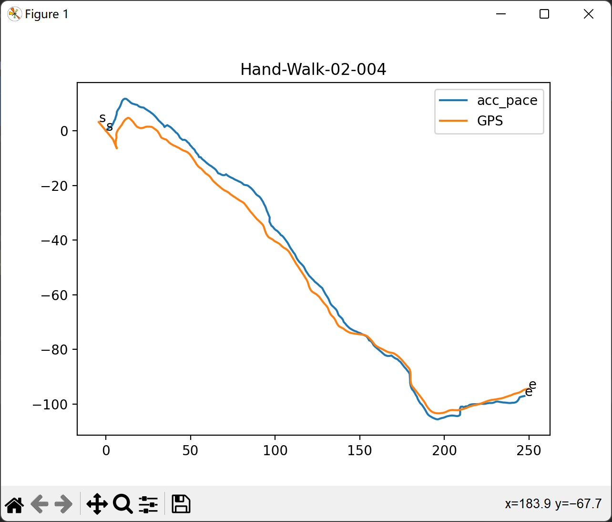

#### **3.5 最终算法实现**

我们最终的算法过程如下：

1. 对数据做预处理，对不同传感器测量的数据做最近邻时间对齐，去除经纬度前若干个偏离明显的异常值后转换到笛卡尔坐标系上。
2. 使用地磁计、做完低通滤波后的线加速计和前10%的GPS数据确定轨迹初态。
3. 使用陀螺仪追踪手机姿态的变化，对姿态建模，将加速度映射到世界坐标系上，并计算方向角。
4. 使用做完低通滤波后的加速计数据来预测步幅和步频，并使用前10%的GPS数据进行矫正。
5. 利用前面计算出的方向角和步幅步频，模拟并计算出轨迹。
6. 将笛卡尔坐标系的轨迹映射回经纬度。

我们最终的算法流程图如下：

​                 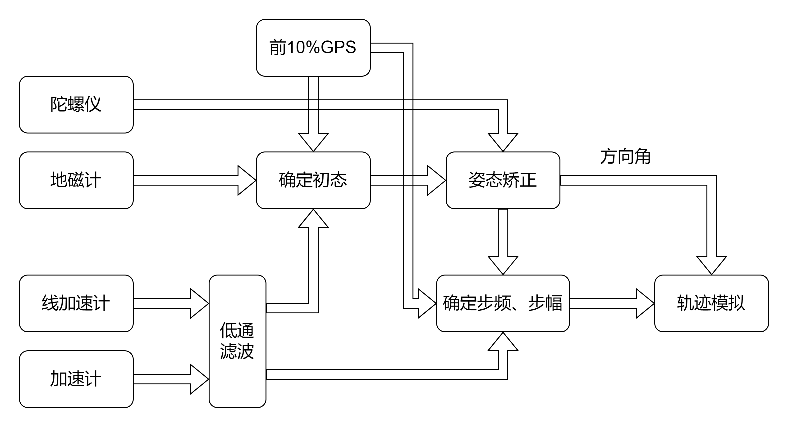

算法流程

### **4. 算法性能评估与代码运行**

#### **4.1 测试集评估结果**

##### **4.1.1 总体测试集评估**

我们的测试集包含了来自不同状态、不同区域、不同设备上的17条数据。

我们在我们收集的数据测试集的运行情况如下图所示：

* 在测试集的运行情况

* 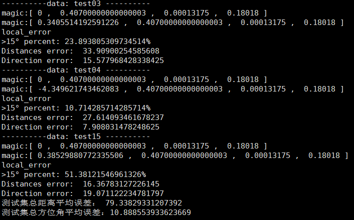

* 在助教提供的test_case0数据上的预测结果如下：

* 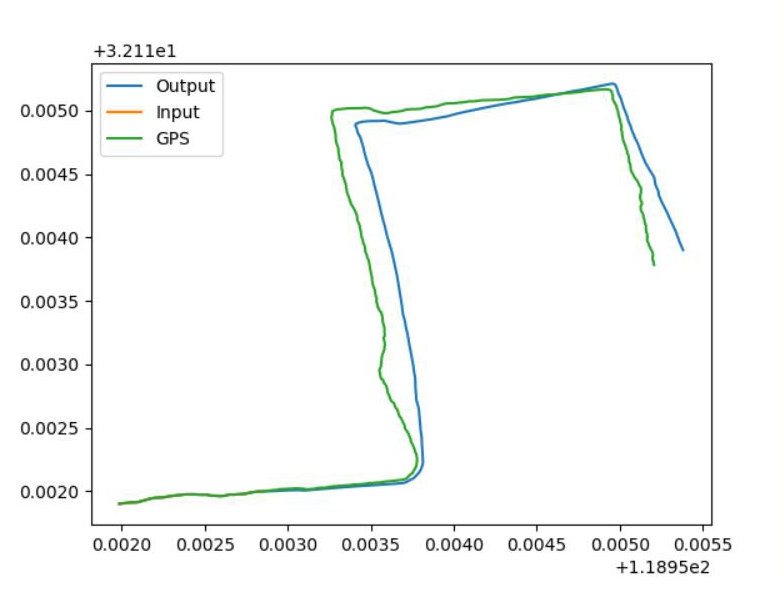

* 我们模型在test_case0上的预测结果，绿色为GPS数据，蓝色为预测数据

  

**通过分析模型在数据集运行后的结果可以得到如下初步结论：**

1. ###### 当手机姿态较为平稳时，我们模型表现的很好，方位角平均误差在7°左右，约10%的方位角数据大于15°。当手机姿态波动较大（表现在走路时大幅度摆臂，或者走路时非正常抖动手机）时，模型性能会有所下降。

   * 当手机姿态平稳时我们模型的性能
   * 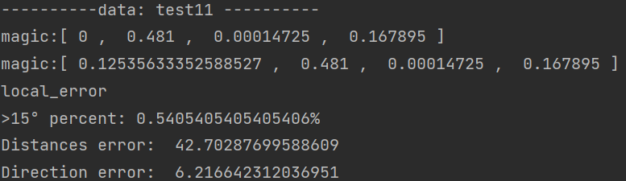
   * 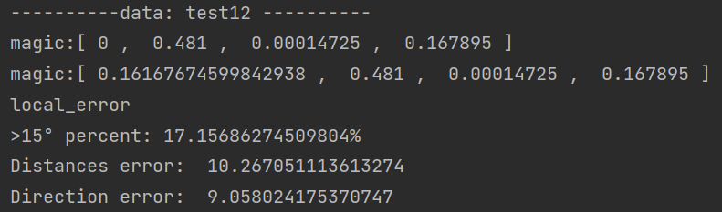
   * 当手机姿态波动较大时我们模型的性能
   * 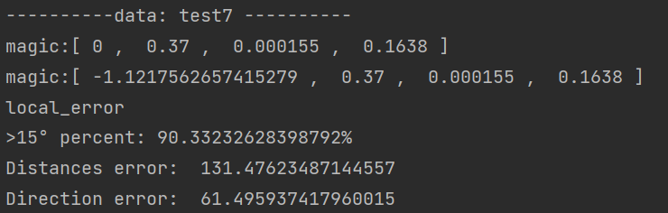
   * 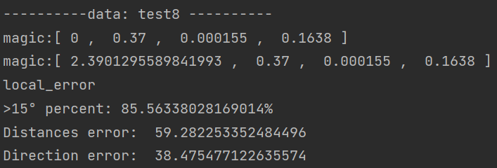

2. ###### 我们的测试数据集共包含了12个不同的设备。我们的模型在不同设备上所表现的性能几乎没有明显变化，这也说明了我们模型具有较强的设备迁移能力。

##### **4.1.2 消融实验**

为了验证上述得到的两种初步结论，我们采用控制变量法，额外做了两组不同的实验。

1. 接下来为了进一步评估人走路姿态对我们模型的影响，我们将我们的模型放在从设备**“03”**
   采集出来的数据上评估（该数据集共有8条数据，**均来自不同的姿态**），得到结果如下：
   * 在设备是“03”的数据集上的评估结果
   * 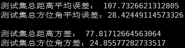

可以看到，我们的模型在同一设备、不同的姿态的数据集上运行时，会产生较大的方差。这也说明我们模型对于不同姿态的波动有性能上的变化，但总体上性能仍然可以保持较高的水平。

2. 为了进一步评估我们模型的设备迁移能力，我们将模型放在手机姿态是**手持平稳-走路**
   的数据集上评估（该数据集共有8条数据，**均来自不同的设备**），得到结果如下：
   * 在手机姿态是“手持-走路”数据集上的评估结果
   * 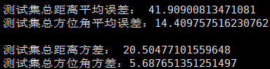

可以看到，我们的模型在姿态较为平稳的数据集上，在不同设备上的运行结果的距离和方位角的方差均较小，这也说明我们的模型在不同的设备上的性能波动并不大，因此我们的模型具有较强的设备迁移能力。

结合上述两组实验得到的结果，可以得出结论：**当人的走路姿态波动较大时，我们的模型预测效果和稳定性会有下降，但总体上仍能保持在较好的水平；我们的模型在不同设备上所展现的性能变化不大，即我们的模型具有较强的设备迁移能力。**

#### **4.2 如何运行**

1. 首先在`config`目录下新建一个`config.json`文件，具体配置方式请参见`/config/Help.md`
   文件，用于指定数据集根文件夹的绝对路径，或者数据集相对于代码文件夹的相对路径。

1. 在将我们收集的数据集路径正确配置好之后，运行`/testset_eval.py`文件，即可得到 **4.1** 所展示的包括测试集总体评估和两个消融实验在内的结果。
   * 其中三个测试函数的内容如注释所示
   * 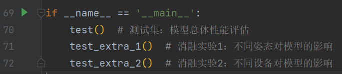
